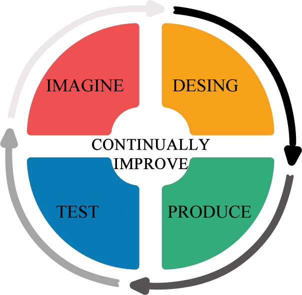
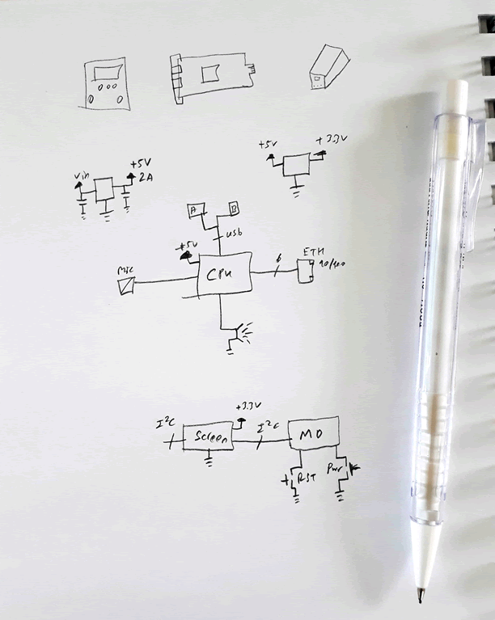
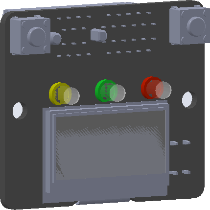
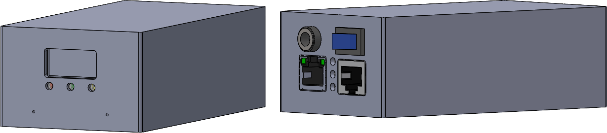
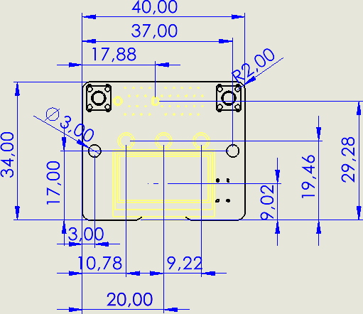
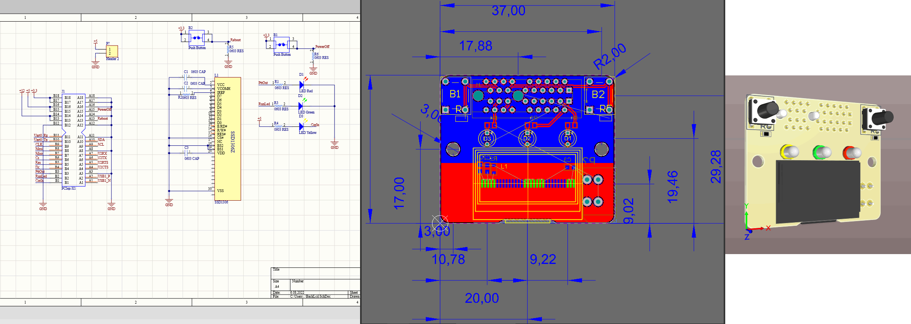
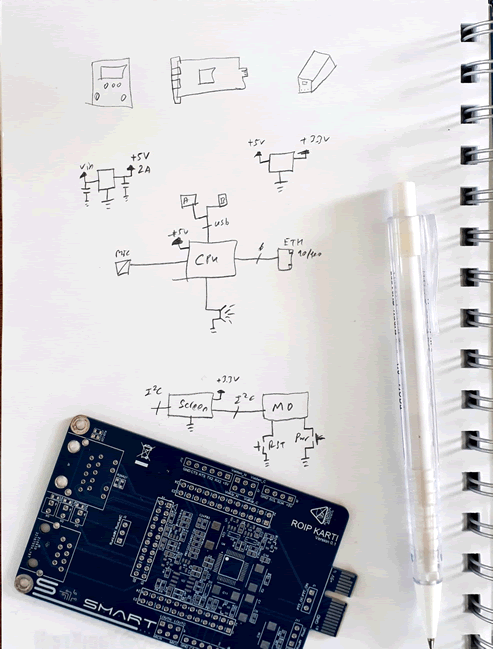
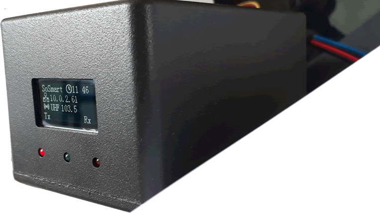
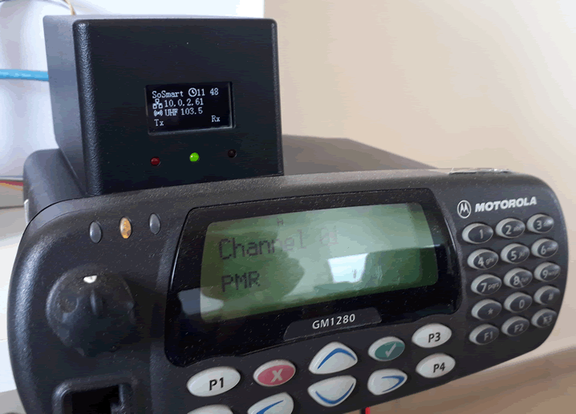

### Hi there 👋
- I'm Salih.
- I have a master's degree in computer engineering. 😄
- I like to create 0 to 100 new products by myself.

- The tools I learned in this process are:
  - C/C++
  - Linux
  - solidworks
  - altium
  - Keil
  - Docker
Etc.

# Four Steps In My Life

- [Imagine](#imagine)
- [Desing](#desing)
- [Produce](#produce)
- [Test](#test)

# Imagine
I always thinking by drawing.

# Desing
My design sequence starts with sometimes finding the box and sometimes drawing the circuits.
Very complicadet. 

# Produce
It is very complex but very exciting.
Hardware,software and mechanic mixed.

# Test

<!--
**SalihPalamut/SalihPalamut** is a ✨ _special_ ✨ repository because its `README.md` (this file) appears on your GitHub profile.

Here are some ideas to get you started:

- 🔭 I’m currently working on ...
- 🌱 I’m currently learning ...
- 👯 I’m looking to collaborate on ...
- 🤔 I’m looking for help with ...
- 💬 Ask me about ...
- 📫 How to reach me: ...
- 😄 Pronouns: ...
- ⚡ Fun fact: ...
-->
